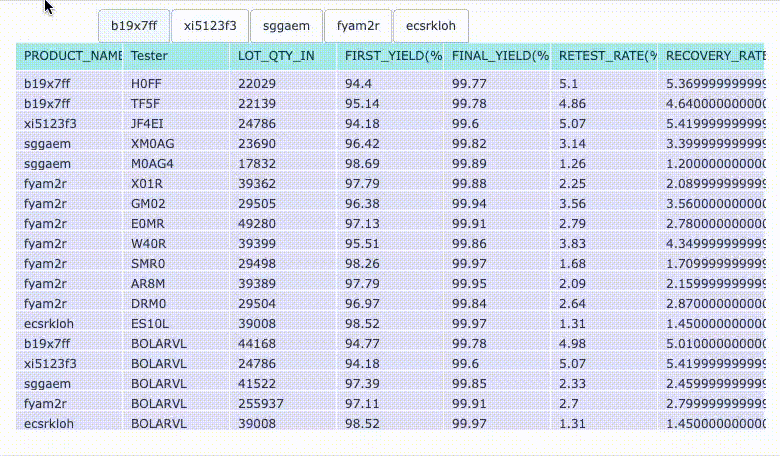

# Interactive tables for Randall

Help Randall to generate interactive tables
App to generate exported single html file for reporting purposes

Sample:

## Quickstart

1. `git clone git@github.com:jakelime/ricky-interactive_tables.git`
1. `pip install -r requirements.txt`
1. `cd ricky-interactive_tables`
1. Load your datafiles (confidential) into `/ricky-interactive_tables/input_files`

   - Accepted are files in CSV format
   - Each CSV file represents a pandas dataframe structure

1. `cli.py` is the entry point, simply run this command `python cli.py`
1. The output file will be generated in root folder, i.e. `/ricky-interactive_tables/dashboard.html`
